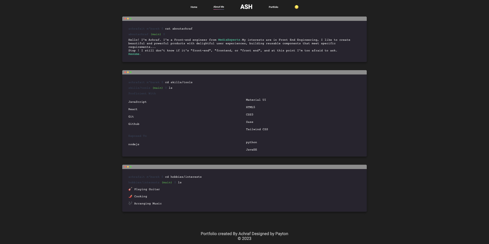

# Portfolio Achraf Ait MK

Welcome to the repository of my personal portfolio. This portfolio is designed to showcase my skills, projects, and professional journey. Inspired by another design whose name I can't recall (a common situation!), this project is built with React, HTML, CSS, and Material-UI.

## About the Portfolio

My portfolio is a showcase of my web development skills. It features my recent projects, professional experiences, and provides an overview of who I am as a developer.

## Key Features

- **Home**: A quick introduction with an overview of my skills, a brief presentation of myself, and links to my social media.
- **About Me**: A page styled like a terminal with an elegant interface where I introduce myself, detail my skills and projects, inspired by another design whose name I can't remember.
- **Portfolio**: A gallery of projects I've worked on, with detailed descriptions and links to GitHub repositories or live demos.

## Technologies Used

The portfolio is developed using the following technologies:

- [](https://reactjs.org/)
- [](https://developer.mozilla.org/en-US/docs/Web/JavaScript)
- [](https://material-ui.com/)
- [](https://developer.mozilla.org/en-US/docs/Web/HTML)
- [](https://sass-lang.com/)

## Screenshots


## How to Contribute

If you'd like to contribute to the improvement of my portfolio, feel free to fork this project, make changes, and submit a pull request. xD

## How to Deploy Locally

1. Clone the repository to your local machine:
   ```bash
   git clone https://github.com/achrafaitmbarek/portfolash
   ```
2.Accédez au répertoire du projet :
  ```bash
   cd portfolash 
   ```
3.Installez les dépendances :
  ```bash
   npm install
```
4.Démarrez l'application :
  ```bash 
   npm start
```



5.Check out my live portfolio: https://achrafaitmk.vercel.app/
